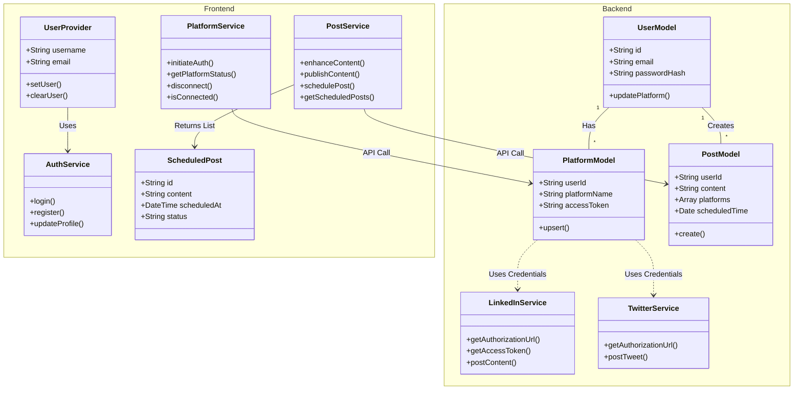
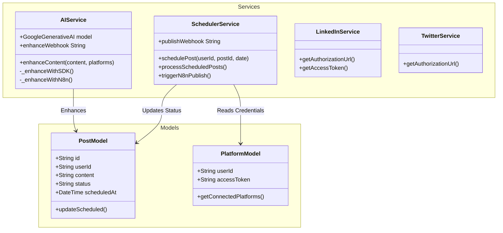
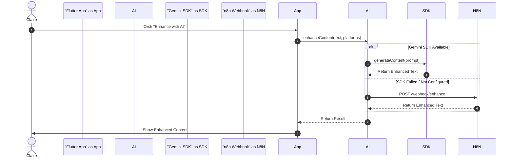
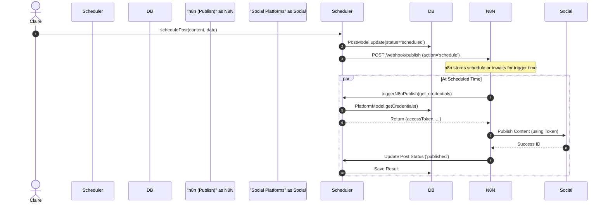
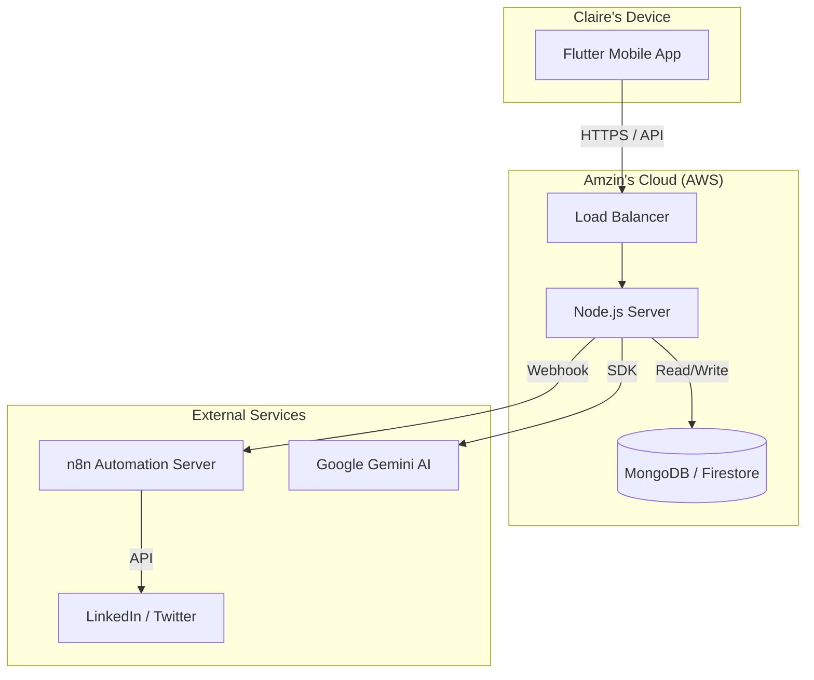

# Concept UML Diagrams for AutoAssist Application

## 1. Use Case Diagram

This diagram illustrates the interactions between the actors **Claire** (User) and **Amzin** (Admin) with the system.

## Detailed Use Case Descriptions

### 1. Identify Actors (Identification des Acteurs)

#### **Principal Actors (Acteurs Principaux)**
These actors initiate the interaction with the system to achieve a goal.
*   **Claire (The User)**: A social media manager or content creator. Her main goal is to create, enhance, and schedule content efficiently across multiple platforms.
*   **Amzin (The Administrator)**: The platform owner or system admin. His goal is to ensure the system is running correctly, manage user accounts, and monitor system health.

#### **Secondary Actors (Acteurs Secondaires)**
These actors provide services to the system to help complete the primary actors' goals.
*   **n8n Automation**: An external workflow automation tool used for complex background tasks like publishing scheduled posts and processing AI requests.
*   **Gemini AI**: The AI engine used to enhance and generate content.
*   **Social Platforms (LinkedIn, Twitter/X)**: External systems where the final content is published.

---

### 2. Use Case Details (Détails des Cas d'Utilisation)

#### **UC1: Login / Register (S'inscrire / Se Connecter)**
*   **Actor**: Claire, Amzin
*   **Description**: Allows users to create an account or access their existing account securely.
*   **Preconditions**: None.
*   **Postconditions**: User is authenticated and redirected to the dashboard.
*   **Main Flow**:
    1.  User opens the app.
    2.  User enters email and password.
    3.  System verifies credentials.
    4.  System grants access.

#### **UC2: Connect Social Accounts (Connecter les Réseaux Sociaux)**
*   **Actor**: Claire
*   **Description**: Link external social media accounts (LinkedIn, Twitter) to the AutoAssist platform to enable posting.
*   **Preconditions**: User is logged in.
*   **Postconditions**: Access tokens are stored securely, and the user can now publish to these platforms.
*   **Main Flow**:
    1.  Claire navigates to "Connections".
    2.  Selects a platform (e.g., LinkedIn).
    3.  System redirects to the platform's OAuth page.
    4.  Claire authorizes the application.
    5.  System receives the authorization code and exchanges it for an access token.
    6.  System confirms connection.

#### **UC3: Create & Enhance Content (Créer et Améliorer le Contenu)**
*   **Actor**: Claire
*   **Secondary Actor**: Gemini AI, n8n
*   **Description**: Draft a new post and use AI to optimize it for specific platforms (e.g., adding hashtags, improving tone).
*   **Main Flow**:
    1.  Claire types a rough draft or idea.
    2.  Claire clicks "Enhance with AI".
    3.  System sends the text to **Gemini AI** (directly or via **n8n**).
    4.  AI generates an optimized version.
    5.  System displays the enhanced version to Claire for review.

#### **UC4: Schedule Post (Planifier une Publication)**
*   **Actor**: Claire
*   **Secondary Actor**: n8n
*   **Description**: Schedule a post to be published automatically at a future date and time.
*   **Main Flow**:
    1.  Claire confirms the content of the post.
    2.  Selects a date and time.
    3.  Clicks "Schedule".
    4.  System saves the post with status `scheduled`.
    5.  **n8n** is notified or later polls for due posts.
    6.  At the scheduled time, n8n triggers the publication.

#### **UC5: Monitor System Health (Surveiller l'État du Système)**
*   **Actor**: Amzin
*   **Description**: Check the status of the server, database connections, and n8n workflows.
*   **Main Flow**:
    1.  Amzin logs into the admin dashboard.
    2.  Views charts showing API usage, error rates, and active users.
    3.  Views logs for any failed scheduled posts.

## 2. Class Diagram

This diagram represents the key classes in the backend, including the new **AIService** and **SchedulerService**.

## 3. Sequence Diagrams

### 3.1 Content Enhancement (Claire uses AI)
Claire wants to improve her post using AI. The system tries Gemini SDK first, then falls back to n8n.

### 3.2 Scheduling & Publishing (Via n8n)
Claire schedules a post, and n8n handles the publishing process.

## 4. Deployment Diagram (Plan UML)

This diagram shows the physical deployment of the system, hosted on **Amzin's Cloud (AWS)**.

