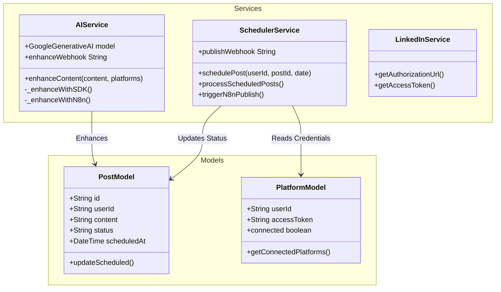
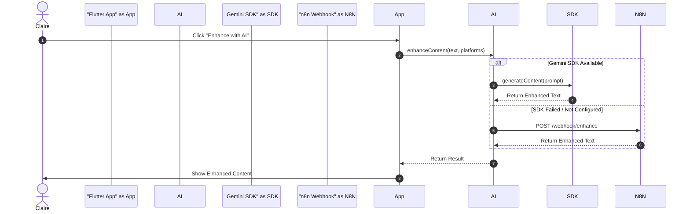
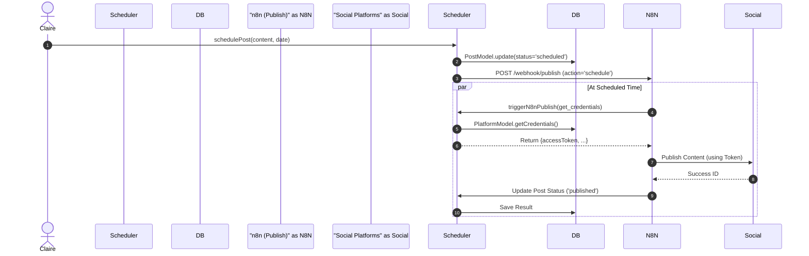
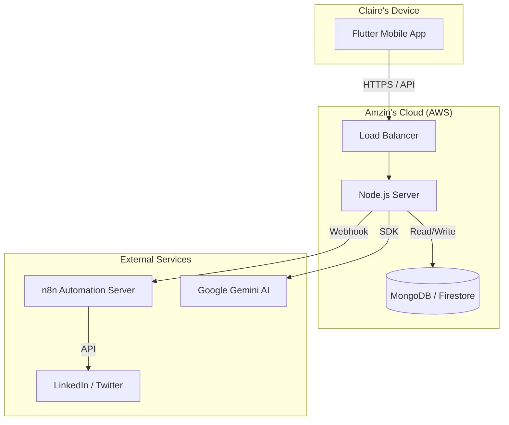

# Concept UML Diagrams & Requirements Specification

## 1. Detailed Requirements Specification (Spécification des Besoins)

### 1.1 Backend (Node.js / Express)
The backend serves as the core logic handler and API provider.
*   **Authentication**: Verify Firebase ID Tokens via middleware.
*   **OAuth Management**: Handle OAuth 2.0 flows for LinkedIn and Twitter (1.0a/2.0).
    *   *Requirement*: Securely store access tokens and refresh tokens in Firestore.
    *   *Requirement*: implementing automatic token exchange on callback.
*   **Content Management**: CRUD operations for Posts (Draft, Scheduled, Published).
*   **AI Integration**: Route requests to Gemini AI (via SDK) or n8n (fallback).
*   **Scheduling**: Manage the scheduling queue and trigger n8n workflows for publication.

### 1.2 Frontend (Flutter Mobile App)
The mobile application provides the user interface for **Claire**.
*   **User Interface**: Modern, responsive UI with "Deep Navy + Electric Blue" theme.
*   **State Management**: Use Providers/Bloc to handle user session and data.
*   **Features**:
    *   **Login/Register**: Identity Platform integration.
    *   **Dashboard**: View post history and stats.
    *   **Composer**: Rich text editor for creating posts.
    *   **AI Tools**: "Enhance" button to trigger AI rewritten content.
    *   **Scheduler**: Date/Time picker for scheduling.

### 1.3 n8n Automation
n8n acts as the "Engine" for complex workflows.
*   **Workflow 1: Content Enhancement**:
    *   Receives raw text -> Calls Gemini AI -> Returns enhanced text.
*   **Workflow 2: Publishing**:
    *   Receives post data + credentials -> Posts to LinkedIn/Twitter API -> Returns success/failure.

### 1.4 Firebase & Infrastructure
*   **Auth**: Handles user identity and JWT generation.
*   **Firestore**: NoSQL database for storing Users, Posts, and Platform Connections.
*   **Hosting**: Backend hosted on **Amzin's Cloud (AWS)**.

---

## 2. Detailed Use Case Diagram (Text & PlantUML)

This diagram details the relationships (`<<include>>`, `<<extend>>`) between use cases.

### 2.1 Use Case Relationships (Relations)
*   **Login (S'authentifier)**: Prerequisite for all other actions.
*   **Create Post (Créer Publication)**: Base use case.
*   **Enhance with AI (Améliorer via IA)**: `<<extend>>` Create Post (Optional step).
*   **Schedule Post (Planifier Publication)**: `<<include>>` Publish Content (Internal system action).
*   **Connect Account (Connecter Compte)**: `<<include>>` OAuth Flow.

### 2.2 PlantUML Use Case Diagram

```mermaid
usecaseDiagram
    actor "Claire (User)" as C
    actor "Amzin (Admin)" as A
    actor "n8n Automation" as N8N
    actor "External APIs" as API

    package "AutoAssist App" {
        usecase "Login / Authenticate" as UC_Login
        usecase "Manage User Profile" as UC_Profile
        usecase "Connect Social Accounts" as UC_Connect
        usecase "Perform OAuth Handshake" as UC_OAuth
        
        usecase "Create Content" as UC_Create
        usecase "Enhance Content (AI)" as UC_Enhance
        usecase "Schedule Post" as UC_Schedule
        usecase "Publish Content" as UC_Publish
        
        usecase "Monitor System" as UC_Monitor
    }

    %% Actor Relationships
    C --> UC_Login
    C --> UC_Profile
    C --> UC_Connect
    C --> UC_Create
    C --> UC_Schedule

    A --> UC_Login
    A --> UC_Monitor

    %% Include & Extend Relationships
    UC_Connect ..> UC_OAuth : <<include>>
    UC_Enhance ..> UC_Create : <<extend>>
    UC_Schedule ..> UC_Publish : <<include>> (via n8n)
    
    %% External System Interactions
    UC_OAuth --> API : Exchange Tokens
    UC_Enhance --> N8N : Trigger AI Workflow
    UC_Publish --> N8N : Trigger Publish Workflow
```

### 2.3 Detailed Use Case Descriptions (Description Détaillée)

#### **UC_Create: Create Content (Créer Contenu)**
*   **Actor**: Claire
*   **Description**: Claire drafts a new social media post.
*   **Includes**: None.
*   **Extends**: `UC_Enhance` (Optional AI improvement).
*   **Main Flow**:
    1.  Claire opens the "Create" screen.
    2.  Types content.
    3.  Selects images (optional).
    4.  Saves as Draft.

#### **UC_Enhance: Enhance Content with AI (Améliorer avec IA)**
*   **Actor**: Claire (Initiator)
*   **Relationship**: `<<extend>>` **Create Content**.
*   **Description**: Claire requests AI to rewrite the text to be more engaging.
*   **Main Flow**:
    1.  (From Create Screen) Claire clicks "Enhance".
    2.  System calls **AIService**.
    3.  **n8n** processes the request with Gemini.
    4.  System replaces/appends the enhanced text.

#### **UC_Connect: Connect Social Account (Connecter Compte)**
*   **Actor**: Claire
*   **Relationship**: `<<include>>` **OAuth Handshake**.
*   **Description**: Link a LinkedIn or Twitter account.
*   **Main Flow**:
    1.  Claire selects "Connect LinkedIn".
    2.  **Include**: System performs **UC_OAuth** (Redirects to LinkedIn -> User Approves -> Callback).
    3.  System stores the returned Access Token.

#### **UC_Schedule: Schedule Post (Planifier)**
*   **Actor**: Claire
*   **Relationship**: `<<include>>` **Publish Content** (deferred).
*   **Description**: Set a future time for the post to go live.
*   **Main Flow**:
    1.  Claire selects a date/time.
    2.  Confirm Schedule.
    3.  System saves Pending Post.
    4.  System notifies **n8n**.
    5.  (Later) **n8n** triggers **UC_Publish**.

---

## 3. Class Diagram

This diagram represents the key classes in the backend, including `AIService` and `SchedulerService`.



## 4. Sequence Diagrams

### 4.1 Content Enhancement (Claire uses AI)



### 4.2 Scheduling & Publishing (Via n8n)



## 5. Deployment Diagram (Plan UML)

Hosted on **Amzin's Cloud (AWS)**.


